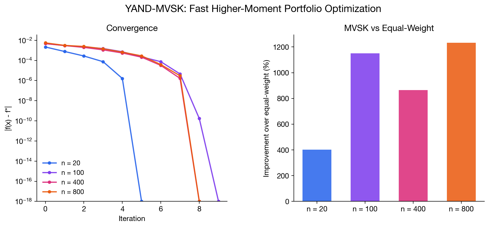

# YAND-MVSK: Portfolio Optimization with Tail Risk Control

**Asset allocation that sees beyond mean and variance. Optimizes return, volatility, skewness, and kurtosis in one shot.**

Markowitz gave us mean-variance. But financial returns have fat tails and asymmetry: the 2008 crash, the COVID drop, the meme stock spikes. YAND-MVSK optimizes across all four statistical moments, so your portfolio accounts for tail risk that traditional optimizers ignore. It solves in 5-10 iterations even for 800+ assets.

<p align="center">
  
</p>

## Who is this for?

- **Quant researchers** building factor portfolios or smart-beta strategies that control for higher moments
- **Risk managers** who want to penalize negative skewness (crash exposure) and excess kurtosis (tail risk)
- **Asset allocators** optimizing across ETFs, stocks, or multi-asset universes where return distributions are non-Gaussian
- **Academic finance**: reproducible implementation of a state-of-the-art MVSK algorithm for benchmarking

## Why higher moments?

Mean-variance optimization assumes returns are Gaussian. Real markets aren't. Equities exhibit negative skewness (crashes are sharper than rallies) and excess kurtosis (extreme moves happen more than a normal distribution predicts). Ignoring these moments means your "optimal" portfolio is optimized for a world that doesn't exist.

YAND-MVSK lets you express preferences over all four moments in a single convex optimization: maximize return, minimize variance, maximize skewness (prefer upside), minimize kurtosis (avoid tail events).

## Quickstart

```bash
uv add yand-mvsk
```

```python
import numpy as np
from yand_mvsk import yand_mvsk_solve, crra_coefficients

# Your return matrix: T observations x n assets
R = np.random.default_rng(42).standard_normal((504, 50)) * 0.02

# Solve: 3 lines, done
result = yand_mvsk_solve(R, crra_coefficients(gamma=6))

print(result.x[:5])       # portfolio weights
print(result.converged)    # True
print(result.n_iter)       # typically 5-10
```

## How it works

The solver never builds O(n³) coskewness tensors or O(n⁴) cokurtosis tensors. Instead, it stores only the T×n return matrix and computes everything through matrix-vector products:

| Operation | Cost | What it replaces |
|---|---|---|
| Gradient | O(Tn) | Would need O(n³) with explicit tensors |
| Hessian-vector product | O(Tn) | Would need O(n⁴) with explicit tensors |
| Quartic line search | O(Tn) | Exact minimization of a degree-4 polynomial |

This means **n=800 solves in 0.05s** on a laptop.

## API

### `yand_mvsk_solve(R, c, **kwargs) → MVSKResult`

| Parameter | Type | Default | Description |
|---|---|---|---|
| `R` | `(T, n) array` | required | Return matrix |
| `c` | `(4,) array` | required | Preference weights [c₁, c₂, c₃, c₄] |
| `x0` | `(n,) array` | equal-weight | Initial portfolio |
| `tau` | `float` | `1e-8` | Lower bound on each weight |
| `tol` | `float` | `1e-6` | KKT convergence tolerance |
| `max_iter` | `int` | `300` | Iteration budget |
| `line_search` | `str` | `'quartic'` | `'quartic'` (exact) or `'armijo'` |
| `use_pcg` | `bool` | `False` | Use conjugate gradients for large problems |
| `verbose` | `bool` | `False` | Print per-iteration diagnostics |

### `crra_coefficients(gamma) → array`

Returns CRRA preference coefficients for risk aversion γ:

```
c = (1, γ/2, γ(γ+1)/6, γ(γ+1)(γ+2)/24)
```

### `check_convexity(c) → bool`

Checks sufficient convexity condition: c₄ > 0 and 8·c₂·c₄ > 3·c₃².

### `MVSKResult`

| Field | Type | Description |
|---|---|---|
| `x` | `ndarray` | Optimal portfolio weights |
| `f_val` | `float` | Objective value |
| `kkt_residual` | `float` | First-order optimality measure |
| `n_iter` | `int` | Iterations used |
| `converged` | `bool` | Whether tolerance was reached |
| `history` | `list[float]` | Per-iteration objective values |

## Performance

Tested on synthetic benchmarks following the paper's protocol (T=252 daily observations, CRRA γ=6):

| Assets (n) | Iterations | Time | KKT residual |
|---|---|---|---|
| 20 | 8 | 0.004s | 2.8e-17 |
| 100 | 7 | 0.006s | 3.4e-7 |
| 200 | 7 | 0.014s | 6.5e-8 |
| 800 | 8 | 0.051s | 3.6e-8 |

## Acknowledgement

This is an independent Python implementation of the YAND-MVSK algorithm by Wang, Niu, Sheshmani, and Yau, not affiliated with or endorsed by the original authors. All credit for the algorithm design, theoretical analysis, and convergence guarantees belongs to them. The affine-normal descent framework originates from the geometric work of Cheng, Yau, and collaborators, later developed into the YAND optimization framework by Niu et al.

Paper: [arXiv:2604.25378](https://arxiv.org/abs/2604.25378) | Prior MATLAB implementation by the authors: [MVSK-Multi](https://github.com/niuyishuai/MVSK-Multi)

If you use this code in research, please cite the original paper and this implementation:

```bibtex
@article{wang2026yandmvsk,
  title={YAND-MVSK: Yau's Affine-Normal Descent for Large-Scale Unrestricted Mean-Variance-Skewness-Kurtosis Portfolio Optimization},
  author={Wang, Ya-Juan and Niu, Yi-Shuai and Sheshmani, Artan and Yau, Shing-Tung},
  journal={arXiv preprint arXiv:2604.25378},
  year={2026}
}

@software{wu2026yandmvsk,
  title={yand-mvsk: Python implementation of YAND-MVSK portfolio optimization},
  author={Wu, Wenbin},
  url={https://github.com/dthinkr/yand-mvsk},
  year={2026}
}
```

## License

MIT
